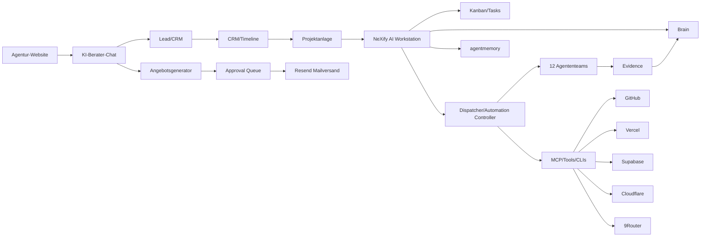

# NeXify AI — Master-Pflichtenheft V3

**Stand:** 2026-06-12 | **Status:** VERBINDLICH | **Version:** 3.0.0
**Owner:** Pascal Courbois / NeXify AI
**Klassifikation:** nexify_internal

---

## 1. Zielarchitektur



## 2. Umsetzungspflichten

### PF-001 API-first Plattformkern
UI darf keine Schattenlogik enthalten. Kernlogik immer im API-Layer.

### PF-002 Domainmodell
- Customer, Lead, Contact, Company
- Conversation, Message
- Offer, OfferLine, Product
- Project, Task, Evidence
- BrainEntry, AgentMemoryEntry
- ApprovalRequest, AutomationRun
- TimelineEvent, Invoice, Payment

### PF-003 Workstation-Module
- Dashboard
- Auftragsfach
- Kanban
- Chat / User-Chat-Driver
- Projekte
- Kunden/CRM
- Angebote
- Support
- Brain / agentmemory
- Evidence
- Automationen
- Integrationen
- Approval Queue
- Logs / Monitoring

### PF-004 Automations-Engine
Pipeline: Trigger → Validator → Context Loader → Policy Gate → Executor → Evidence Writer → Brain/agentmemory Sync → Review Hook → Retry/Recovery → Abort Condition

### PF-005 Angebotsgenerator
Pipeline: Lead/Chatdaten → Produktkatalog → Scope → Aufwand/Marge/Preis → Optionen → Risiken → Angebot → Review → PDF/E-Mail → Resend → CRM/Timeline/Brain

### PF-006 Kundensuche
Nur als `LEAD_PENDING` bis Rechts-/Policy-Gate bestanden ist. Kein Massenmailing.

### PF-007 Brain-first
Vor jeder relevanten Arbeit: Brain-Query, Skill-Check, dann Handlung.

### PF-008 Designsystem
Graphite Premium für alle Frontends, Dokumente, E-Mails, Signaturen und PDFs.

### PF-009 CI/CD
Mit Tests, Lint, Build, Security, Evidence und Approval-Gate.

### PF-010 Betrieb
Healthchecks, Logs, Metrics, Alerts, Backup, Rollback, Secret-Ref-Verwaltung.

## 3. Technologie-Entscheidungen

| Bereich | Entscheidung | Begründung |
|---------|-------------|------------|
| Frontend | Next.js / React (Website + Workstation) | Bestehende Codebasis |
| Backend | Python / FastAPI | Bestehende Services |
| Datenbank | Supabase (Postgres + Auth + RLS + Storage + Realtime) | Betriebsbereit, 12 Container |
| Vektor | Qdrant | Betriebsbereit |
| Memory | Brain (kanonisch) + agentmemory (arbeitsnah) | Bestehend |
| KI-Modelle | 9Router mit nexifyai-combo-llm | Betriebsbereit |
| Mail | Resend | Bestehend |
| DNS/Proxy | Cloudflare Tunnel | Bestehend |
| Deploy | Vercel + Docker | Bestehend |

## 4. Datenfluss

```
Eingabe (Chat/Website/API) → Dispatcher → Policy Gate → Team/Agent → 
Evidence → Brain Sync → Exit (CRM/Mail/Workstation/Response)
```
