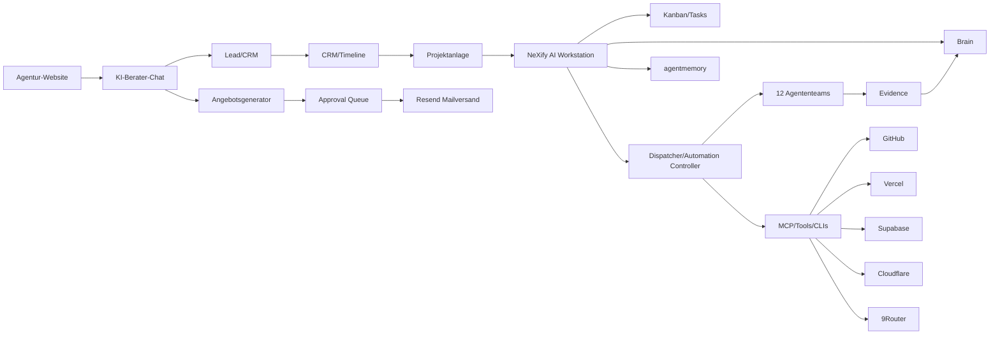

# NeXify AI — Master-Pflichtenheft V3

## 1. Zielarchitektur

## 2. Umsetzungspflichten

- PF-001 API-first Plattformkern. UI darf keine Schattenlogik enthalten.
- PF-002 Domainmodell: Customer, Lead, Contact, Company, Conversation, Message, Offer, OfferLine, Product, Project, Task, Evidence, BrainEntry, AgentMemoryEntry, ApprovalRequest, AutomationRun, TimelineEvent, Invoice, Payment.
- PF-003 Workstation-Module: Dashboard, Auftragsfach, Kanban, Chat, User-Chat-Driver, Projekte, Kunden/CRM, Angebote, Support, Brain/agentmemory, Evidence, Automationen, Integrationen, Approval Queue, Logs/Monitoring.
- PF-004 Automations-Engine: Trigger, Validator, Context Loader, Policy Gate, Executor, Evidence Writer, Brain/agentmemory Sync, Review Hook, Retry/Recovery, Abort Condition.
- PF-005 Angebotsgenerator: Lead/Chatdaten, Produktkatalog, Scope, Aufwand/Marge/Preis, Optionen, Risiken, Angebot, Review, PDF/E-Mail, Resend, CRM/Timeline/Brain.
- PF-006 Kundensuche nur als `LEAD_PENDING` bis Rechts-/Policy-Gate bestanden ist.
- PF-007 Brain-first vor jeder relevanten Arbeit.
- PF-008 Designsystem für alle Frontends, Dokumente, E-Mails, Signaturen und PDFs.
- PF-009 CI/CD mit Tests, Lint, Build, Security, Evidence und Approval.
- PF-010 Betrieb mit Healthchecks, Logs, Metrics, Alerts, Backup, Rollback, Secret-Ref-Verwaltung.
