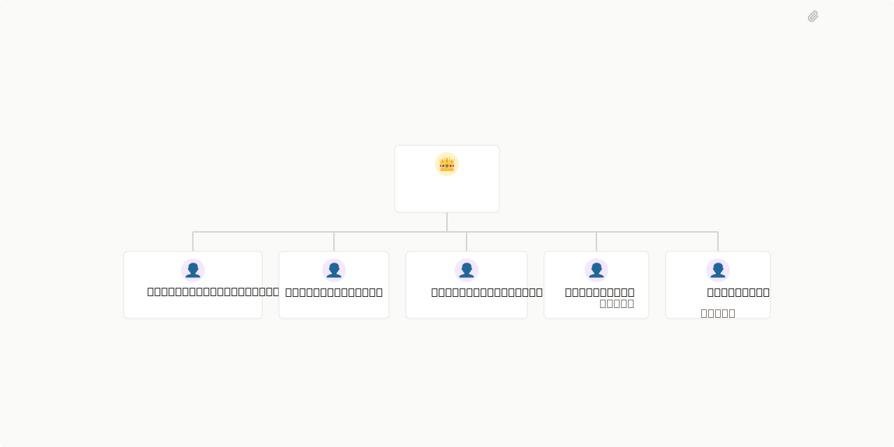

# NeXify AI

> by NeXify chat it. Automate it.



## What's Inside

> This is an [Agent Company](https://agentcompanies.io) package from [Paperclip](https://paperclip.ing)

| Content | Count |
|---------|-------|
| Agents | 6 |
| Skills | 74 |

### Agents

| Agent | Role | Reports To |
|-------|------|------------|
| NeXify AI CEO | CEO | — |
| NeXify AI Developer | general | nexify-ai-ceo |
| NeXify Analyst | general | nexify-ai-ceo |
| NeXify Architekt | general | nexify-ai-ceo |
| NeXify Ops | general | nexify-ai-ceo |
| NeXify QA | general | nexify-ai-ceo |

### Skills

| Skill | Description | Source |
|-------|-------------|--------|
| agent-evaluation | Testing and benchmarking LLM agents including behavioral testing, capability assessment, reliability metrics, and production monitoring—where even top agents achieve less than 50% on real-world benchmarks Use when: agent testing, agent evaluation, benchmark agents, agent reliability, test agent. | [github](https://github.com/davila7/claude-code-templates.git) |
| agent-management | Create, manage, and orchestrate AI agents using the AI Maestro CLI. Use when the user asks to "create agent", "list agents", "delete agent", "hibernate agent", "wake agent", "install plugin", "show agent", "restart agent", or any agent lifecycle management task. | [github](https://github.com/davila7/claude-code-templates.git) |
| agent-manager-skill | Manage multiple local CLI agents via tmux sessions (start/stop/monitor/assign) with cron-friendly scheduling. | [github](https://github.com/davila7/claude-code-templates.git) |
| agent-memory-mcp | A hybrid memory system that provides persistent, searchable knowledge management for AI agents (Architecture, Patterns, Decisions). | [github](https://github.com/davila7/claude-code-templates.git) |
| agent-memory-systems | Memory is the cornerstone of intelligent agents. Without it, every interaction starts from zero. This skill covers the architecture of agent memory: short-term (context window), long-term (vector stores), and the cognitive architectures that organize them.  Key insight: Memory isn't just storage - it's retrieval. A million stored facts mean nothing if you can't find the right one. Chunking, embedding, and retrieval strategies determine whether your agent remembers or forgets.  The field is fragm | [github](https://github.com/davila7/claude-code-templates.git) |
| agent-messaging | Send and receive cryptographically signed messages between AI agents using the Agent Messaging Protocol (AMP). Use when the user asks to "send a message to an agent", "check agent inbox", "message another agent", "reply to a message", "notify an agent", or any inter-agent communication task. | [github](https://github.com/davila7/claude-code-templates.git) |
| agent-tool-builder | Tools are how AI agents interact with the world. A well-designed tool is the difference between an agent that works and one that hallucinates, fails silently, or costs 10x more tokens than necessary.  This skill covers tool design from schema to error handling. JSON Schema best practices, description writing that actually helps the LLM, validation, and the emerging MCP standard that's becoming the lingua franca for AI tools.  Key insight: Tool descriptions are more important than tool implementa | [github](https://github.com/davila7/claude-code-templates.git) |
| ai-agents-architect | Expert in designing and building autonomous AI agents. Masters tool use, memory systems, planning strategies, and multi-agent orchestration. Use when: build agent, AI agent, autonomous agent, tool use, function calling. | [github](https://github.com/davila7/claude-code-templates.git) |
| autogpt-agents | Autonomous AI agent platform for building and deploying continuous agents. Use when creating visual workflow agents, deploying persistent autonomous agents, or building complex multi-step AI automation systems. | [github](https://github.com/davila7/claude-code-templates.git) |
| autonomous-agent-patterns | Design patterns for building autonomous coding agents. Covers tool integration, permission systems, browser automation, and human-in-the-loop workflows. Use when building AI agents, designing tool APIs, implementing permission systems, or creating autonomous coding assistants. | [github](https://github.com/davila7/claude-code-templates.git) |
| autonomous-agents | Autonomous agents are AI systems that can independently decompose goals, plan actions, execute tools, and self-correct without constant human guidance. The challenge isn't making them capable - it's making them reliable. Every extra decision multiplies failure probability.  This skill covers agent loops (ReAct, Plan-Execute), goal decomposition, reflection patterns, and production reliability. Key insight: compounding error rates kill autonomous agents. A 95% success rate per step drops to 60% b | [github](https://github.com/davila7/claude-code-templates.git) |
| axolotl | Expert guidance for fine-tuning LLMs with Axolotl - YAML configs, 100+ models, LoRA/QLoRA, DPO/KTO/ORPO/GRPO, multimodal support | [github](https://github.com/davila7/claude-code-templates.git) |
| behavioral-modes | AI operational modes (brainstorm, implement, debug, review, teach, ship, orchestrate). Use to adapt behavior based on task type. | [github](https://github.com/davila7/claude-code-templates.git) |
| Claude Code Guide | Master guide for using Claude Code effectively. Includes configuration templates, prompting strategies "Thinking" keywords, debugging techniques, and best practices for interacting with the agent. | [github](https://github.com/davila7/claude-code-templates.git) |
| computer-use-agents | Build AI agents that interact with computers like humans do - viewing screens, moving cursors, clicking buttons, and typing text. Covers Anthropic's Computer Use, OpenAI's Operator/CUA, and open-source alternatives. Critical focus on sandboxing, security, and handling the unique challenges of vision-based control. Use when: computer use, desktop automation agent, screen control AI, vision-based agent, GUI automation. | [github](https://github.com/davila7/claude-code-templates.git) |
| context-window-management | Strategies for managing LLM context windows including summarization, trimming, routing, and avoiding context rot Use when: context window, token limit, context management, context engineering, long context. | [github](https://github.com/davila7/claude-code-templates.git) |
| context7-auto-research | Automatically fetch latest library/framework documentation for Claude Code via Context7 API | [github](https://github.com/davila7/claude-code-templates.git) |
| conversation-memory | Persistent memory systems for LLM conversations including short-term, long-term, and entity-based memory Use when: conversation memory, remember, memory persistence, long-term memory, chat history. | [github](https://github.com/davila7/claude-code-templates.git) |
| crewai-multi-agent | Multi-agent orchestration framework for autonomous AI collaboration. Use when building teams of specialized agents working together on complex tasks, when you need role-based agent collaboration with memory, or for production workflows requiring sequential/hierarchical execution. Built without LangChain dependencies for lean, fast execution. | [github](https://github.com/davila7/claude-code-templates.git) |
| crewai | Expert in CrewAI - the leading role-based multi-agent framework used by 60% of Fortune 500 companies. Covers agent design with roles and goals, task definition, crew orchestration, process types (sequential, hierarchical, parallel), memory systems, and flows for complex workflows. Essential for building collaborative AI agent teams. Use when: crewai, multi-agent team, agent roles, crew of agents, role-based agents. | [github](https://github.com/davila7/claude-code-templates.git) |
| data-engineer | Build scalable data pipelines, modern data warehouses, and real-time streaming architectures. Implements Apache Spark, dbt, Airflow, and cloud-native data platforms. | [github](https://github.com/davila7/claude-code-templates.git) |
| data-scientist | Expert data scientist for advanced analytics, machine learning, and statistical modeling. Handles complex data analysis, predictive modeling, and business intelligence. | [github](https://github.com/davila7/claude-code-templates.git) |
| datadog-cli | Datadog CLI for searching logs, querying metrics, tracing requests, and managing dashboards. Use this when debugging production issues or working with Datadog observability. | [github](https://github.com/davila7/claude-code-templates.git) |
| deep-research-notebooklm | Deep research skill powered by NotebookLM MCP. Conducts structured multi-source research (market analysis, competitive intel, trend analysis, prospect research) using Google NotebookLM as the research engine, then delivers formatted briefs and optional studio artifacts (slides, audio podcasts, videos, infographics, reports, mind maps). | [github](https://github.com/davila7/claude-code-templates.git) |
| deep-research | Run autonomous research tasks that plan, search, read, and synthesize information into comprehensive reports. | [github](https://github.com/davila7/claude-code-templates.git) |
| deepspeed | Expert guidance for distributed training with DeepSpeed - ZeRO optimization stages, pipeline parallelism, FP16/BF16/FP8, 1-bit Adam, sparse attention | [github](https://github.com/davila7/claude-code-templates.git) |
| dispatching-parallel-agents | Use when facing 2+ independent tasks that can be worked on without shared state or sequential dependencies | [github](https://github.com/davila7/claude-code-templates.git) |
| docs-search | Search auto-generated codebase documentation for function signatures, API docs, class definitions, and code comments. Use when the user asks to "search docs", "find documentation", "look up a function", "check the API", or before implementing changes to verify correct signatures and patterns. | [github](https://github.com/davila7/claude-code-templates.git) |
| evaluating-code-models | Evaluates code generation models across HumanEval, MBPP, MultiPL-E, and 15+ benchmarks with pass@k metrics. Use when benchmarking code models, comparing coding abilities, testing multi-language support, or measuring code generation quality. Industry standard from BigCode Project used by HuggingFace leaderboards. | [github](https://github.com/davila7/claude-code-templates.git) |
| evaluating-llms-harness | Evaluates LLMs across 60+ academic benchmarks (MMLU, HumanEval, GSM8K, TruthfulQA, HellaSwag). Use when benchmarking model quality, comparing models, reporting academic results, or tracking training progress. Industry standard used by EleutherAI, HuggingFace, and major labs. Supports HuggingFace, vLLM, APIs. | [github](https://github.com/davila7/claude-code-templates.git) |
| gemini-api-agent-platform | Guides the usage of the Gemini API on Agent Platform with the Google Gen AI SDK for enterprise AI applications. Covers SDK usage (Python, JS/TS, Go, Java, C#), capabilities like Live API, tools, multimedia generation, caching, and batch prediction. | [github](https://github.com/davila7/claude-code-templates.git) |
| gemini | Use when the user asks to run Gemini CLI for code review, plan review, or big context (>200k) processing. Ideal for comprehensive analysis requiring large context windows. Uses Gemini 3 Pro by default for state-of-the-art reasoning and coding. | [github](https://github.com/davila7/claude-code-templates.git) |
| gepetto | Creates detailed, sectionized implementation plans through research, stakeholder interviews, and multi-LLM review. Use when planning features that need thorough pre-implementation analysis. | [github](https://github.com/davila7/claude-code-templates.git) |
| graph-query | Query the code graph database to understand component relationships, dependencies, and change impact. Use when the user asks to "find callers", "check dependencies", "what uses this", "show relationships", "find serializers", or when reading code and needing to understand what depends on a component before modifications. | [github](https://github.com/davila7/claude-code-templates.git) |
| huggingface-accelerate | Simplest distributed training API. 4 lines to add distributed support to any PyTorch script. Unified API for DeepSpeed/FSDP/Megatron/DDP. Automatic device placement, mixed precision (FP16/BF16/FP8). Interactive config, single launch command. HuggingFace ecosystem standard. | [github](https://github.com/davila7/claude-code-templates.git) |
| jira | Use when the user mentions Jira issues (e.g., "PROJ-123"), asks about tickets, wants to create/view/update issues, check sprint status, or manage their Jira workflow. Triggers on keywords like "jira", "issue", "ticket", "sprint", "backlog", or issue key patterns. | [github](https://github.com/davila7/claude-code-templates.git) |
| knowledge-distillation | Compress large language models using knowledge distillation from teacher to student models. Use when deploying smaller models with retained performance, transferring GPT-4 capabilities to open-source models, or reducing inference costs. Covers temperature scaling, soft targets, reverse KLD, logit distillation, and MiniLLM training strategies. | [github](https://github.com/davila7/claude-code-templates.git) |
| lambda-labs-gpu-cloud | Reserved and on-demand GPU cloud instances for ML training and inference. Use when you need dedicated GPU instances with simple SSH access, persistent filesystems, or high-performance multi-node clusters for large-scale training. | [github](https://github.com/davila7/claude-code-templates.git) |
| langchain | Framework for building LLM-powered applications with agents, chains, and RAG. Supports multiple providers (OpenAI, Anthropic, Google), 500+ integrations, ReAct agents, tool calling, memory management, and vector store retrieval. Use for building chatbots, question-answering systems, autonomous agents, or RAG applications. Best for rapid prototyping and production deployments. | [github](https://github.com/davila7/claude-code-templates.git) |
| langfuse | Expert in Langfuse - the open-source LLM observability platform. Covers tracing, prompt management, evaluation, datasets, and integration with LangChain, LlamaIndex, and OpenAI. Essential for debugging, monitoring, and improving LLM applications in production. Use when: langfuse, llm observability, llm tracing, prompt management, llm evaluation. | [github](https://github.com/davila7/claude-code-templates.git) |
| langgraph | Expert in LangGraph - the production-grade framework for building stateful, multi-actor AI applications. Covers graph construction, state management, cycles and branches, persistence with checkpointers, human-in-the-loop patterns, and the ReAct agent pattern. Used in production at LinkedIn, Uber, and 400+ companies. This is LangChain's recommended approach for building agents. Use when: langgraph, langchain agent, stateful agent, agent graph, react agent. | [github](https://github.com/davila7/claude-code-templates.git) |
| llama-cpp | Runs LLM inference on CPU, Apple Silicon, and consumer GPUs without NVIDIA hardware. Use for edge deployment, M1/M2/M3 Macs, AMD/Intel GPUs, or when CUDA is unavailable. Supports GGUF quantization (1.5-8 bit) for reduced memory and 4-10× speedup vs PyTorch on CPU. | [github](https://github.com/davila7/claude-code-templates.git) |
| llama-factory | Expert guidance for fine-tuning LLMs with LLaMA-Factory - WebUI no-code, 100+ models, 2/3/4/5/6/8-bit QLoRA, multimodal support | [github](https://github.com/davila7/claude-code-templates.git) |
| llamaindex | Data framework for building LLM applications with RAG. Specializes in document ingestion (300+ connectors), indexing, and querying. Features vector indices, query engines, agents, and multi-modal support. Use for document Q&A, chatbots, knowledge retrieval, or building RAG pipelines. Best for data-centric LLM applications. | [github](https://github.com/davila7/claude-code-templates.git) |
| llm-app-patterns | Production-ready patterns for building LLM applications. Covers RAG pipelines, agent architectures, prompt IDEs, and LLMOps monitoring. Use when designing AI applications, implementing RAG, building agents, or setting up LLM observability. | [github](https://github.com/davila7/claude-code-templates.git) |
| llm-evaluation | Master comprehensive evaluation strategies for LLM applications, from automated metrics to human evaluation and A/B testing. | [github](https://github.com/davila7/claude-code-templates.git) |
| llm-ops | LLM Operations -- RAG, embeddings, vector databases, fine-tuning, prompt engineering avancado, custos de LLM, evals de qualidade e arquiteturas de IA para producao. | [github](https://github.com/davila7/claude-code-templates.git) |
| long-context | Extend context windows of transformer models using RoPE, YaRN, ALiBi, and position interpolation techniques. Use when processing long documents (32k-128k+ tokens), extending pre-trained models beyond original context limits, or implementing efficient positional encodings. Covers rotary embeddings, attention biases, interpolation methods, and extrapolation strategies for LLMs. | [github](https://github.com/davila7/claude-code-templates.git) |
| memory-search | Search conversation history and semantic memory to recall previous discussions, decisions, and context. Use when the user asks to "search memory", "what did we discuss", "remember when", "find previous conversation", "check history", or before starting work to recall prior decisions. | [github](https://github.com/davila7/claude-code-templates.git) |
| modal-serverless-gpu | Serverless GPU cloud platform for running ML workloads. Use when you need on-demand GPU access without infrastructure management, deploying ML models as APIs, or running batch jobs with automatic scaling. | [github](https://github.com/davila7/claude-code-templates.git) |
| model-merging | Merge multiple fine-tuned models using mergekit to combine capabilities without retraining. Use when creating specialized models by blending domain-specific expertise (math + coding + chat), improving performance beyond single models, or experimenting rapidly with model variants. Covers SLERP, TIES-Merging, DARE, Task Arithmetic, linear merging, and production deployment strategies. | [github](https://github.com/davila7/claude-code-templates.git) |
| model-pruning | Reduce LLM size and accelerate inference using pruning techniques like Wanda and SparseGPT. Use when compressing models without retraining, achieving 50% sparsity with minimal accuracy loss, or enabling faster inference on hardware accelerators. Covers unstructured pruning, structured pruning, N:M sparsity, magnitude pruning, and one-shot methods. | [github](https://github.com/davila7/claude-code-templates.git) |
| moe-training | Train Mixture of Experts (MoE) models using DeepSpeed or HuggingFace. Use when training large-scale models with limited compute (5× cost reduction vs dense models), implementing sparse architectures like Mixtral 8x7B or DeepSeek-V3, or scaling model capacity without proportional compute increase. Covers MoE architectures, routing mechanisms, load balancing, expert parallelism, and inference optimization. | [github](https://github.com/davila7/claude-code-templates.git) |
| nemo-curator | GPU-accelerated data curation for LLM training. Supports text/image/video/audio. Features fuzzy deduplication (16× faster), quality filtering (30+ heuristics), semantic deduplication, PII redaction, NSFW detection. Scales across GPUs with RAPIDS. Use for preparing high-quality training datasets, cleaning web data, or deduplicating large corpora. | [github](https://github.com/davila7/claude-code-templates.git) |
| nemo-evaluator-sdk | Evaluates LLMs across 100+ benchmarks from 18+ harnesses (MMLU, HumanEval, GSM8K, safety, VLM) with multi-backend execution. Use when needing scalable evaluation on local Docker, Slurm HPC, or cloud platforms. NVIDIA's enterprise-grade platform with container-first architecture for reproducible benchmarking. | [github](https://github.com/davila7/claude-code-templates.git) |
| peft-fine-tuning | Parameter-efficient fine-tuning for LLMs using LoRA, QLoRA, and 25+ methods. Use when fine-tuning large models (7B-70B) with limited GPU memory, when you need to train <1% of parameters with minimal accuracy loss, or for multi-adapter serving. HuggingFace's official library integrated with transformers ecosystem. | [github](https://github.com/davila7/claude-code-templates.git) |
| planning | Create and manage persistent markdown planning files for structured task execution. Use when the user asks to "create a plan", "track progress", "start a research project", or when a task requires more than 5 tool calls and needs structured phase tracking to stay focused and avoid goal drift. | [github](https://github.com/davila7/claude-code-templates.git) |
| pytorch-fsdp | Expert guidance for Fully Sharded Data Parallel training with PyTorch FSDP - parameter sharding, mixed precision, CPU offloading, FSDP2 | [github](https://github.com/davila7/claude-code-templates.git) |
| pytorch-lightning | High-level PyTorch framework with Trainer class, automatic distributed training (DDP/FSDP/DeepSpeed), callbacks system, and minimal boilerplate. Scales from laptop to supercomputer with same code. Use when you want clean training loops with built-in best practices. | [github](https://github.com/davila7/claude-code-templates.git) |
| ray-data | Scalable data processing for ML workloads. Streaming execution across CPU/GPU, supports Parquet/CSV/JSON/images. Integrates with Ray Train, PyTorch, TensorFlow. Scales from single machine to 100s of nodes. Use for batch inference, data preprocessing, multi-modal data loading, or distributed ETL pipelines. | [github](https://github.com/davila7/claude-code-templates.git) |
| ray-train | Distributed training orchestration across clusters. Scales PyTorch/TensorFlow/HuggingFace from laptop to 1000s of nodes. Built-in hyperparameter tuning with Ray Tune, fault tolerance, elastic scaling. Use when training massive models across multiple machines or running distributed hyperparameter sweeps. | [github](https://github.com/davila7/claude-code-templates.git) |
| serving-llms-vllm | Serves LLMs with high throughput using vLLM's PagedAttention and continuous batching. Use when deploying production LLM APIs, optimizing inference latency/throughput, or serving models with limited GPU memory. Supports OpenAI-compatible endpoints, quantization (GPTQ/AWQ/FP8), and tensor parallelism. | [github](https://github.com/davila7/claude-code-templates.git) |
| sglang | Fast structured generation and serving for LLMs with RadixAttention prefix caching. Use for JSON/regex outputs, constrained decoding, agentic workflows with tool calls, or when you need 5× faster inference than vLLM with prefix sharing. Powers 300,000+ GPUs at xAI, AMD, NVIDIA, and LinkedIn. | [github](https://github.com/davila7/claude-code-templates.git) |
| skypilot-multi-cloud-orchestration | Multi-cloud orchestration for ML workloads with automatic cost optimization. Use when you need to run training or batch jobs across multiple clouds, leverage spot instances with auto-recovery, or optimize GPU costs across providers. | [github](https://github.com/davila7/claude-code-templates.git) |
| speculative-decoding | Accelerate LLM inference using speculative decoding, Medusa multiple heads, and lookahead decoding techniques. Use when optimizing inference speed (1.5-3.6× speedup), reducing latency for real-time applications, or deploying models with limited compute. Covers draft models, tree-based attention, Jacobi iteration, parallel token generation, and production deployment strategies. | [github](https://github.com/davila7/claude-code-templates.git) |
| tensorrt-llm | Optimizes LLM inference with NVIDIA TensorRT for maximum throughput and lowest latency. Use for production deployment on NVIDIA GPUs (A100/H100), when you need 10-100x faster inference than PyTorch, or for serving models with quantization (FP8/INT4), in-flight batching, and multi-GPU scaling. | [github](https://github.com/davila7/claude-code-templates.git) |
| training-llms-megatron | Trains large language models (2B-462B parameters) using NVIDIA Megatron-Core with advanced parallelism strategies. Use when training models >1B parameters, need maximum GPU efficiency (47% MFU on H100), or require tensor/pipeline/sequence/context/expert parallelism. Production-ready framework used for Nemotron, LLaMA, DeepSeek. | [github](https://github.com/davila7/claude-code-templates.git) |
| unsloth | Expert guidance for fast fine-tuning with Unsloth - 2-5x faster training, 50-80% less memory, LoRA/QLoRA optimization | [github](https://github.com/davila7/claude-code-templates.git) |
| paperclip-board | Manage a Paperclip company as a board member via chat. Covers onboarding (company creation, CEO setup, hiring plans), agent management, approvals, task monitoring, cost oversight, and work product review. Use this skill whenever the user wants to interact with their Paperclip control plane. | [github](https://github.com/paperclipai/paperclip/tree/master/skills/paperclip-board) |
| paperclip-converting-plans-to-tasks | The Paperclip way of converting a plan into executable tasks. Use whenever you are asked to plan, scope, or break down work inside a Paperclip company. Industry-agnostic guidance on how to translate a plan into assigned issues with the right specialty, dependencies, and parallelization so Paperclip's executor can pick up the work — it does not prescribe a plan format. Pair with the `paperclip` skill, which covers the mechanics of writing the plan document and reassigning the issue. | [github](https://github.com/paperclipai/paperclip/tree/master/skills/paperclip-converting-plans-to-tasks) |
| paperclip-create-agent | Create new agents in Paperclip with governance-aware hiring. Use when you need to inspect adapter configuration options, compare existing agent configs, draft a new agent prompt/config, and submit a hire request. | [github](https://github.com/paperclipai/paperclip/tree/master/skills/paperclip-create-agent) |
| paperclip | Interact with the Paperclip control plane API to manage tasks, coordinate with other agents, and follow company governance. Use when you need to check assignments, update task status, delegate work, post comments, set up or manage routines (recurring scheduled tasks), or call any Paperclip API endpoint. Do NOT use for the actual domain work itself (writing code, research, etc.) — only for Paperclip coordination. | [github](https://github.com/paperclipai/paperclip/tree/master/skills/paperclip) |
| para-memory-files | File-based memory system using Tiago Forte's PARA method. Use this skill whenever you need to store, retrieve, update, or organize knowledge across sessions. Covers three memory layers: (1) Knowledge graph in PARA folders with atomic YAML facts, (2) Daily notes as raw timeline, (3) Tacit knowledge about user patterns. Also handles planning files, memory decay, weekly synthesis, and recall via qmd. Trigger on any memory operation: saving facts, writing daily notes, creating entities, running weekly synthesis, recalling past context, or managing plans. | [github](https://github.com/paperclipai/paperclip/tree/master/skills/para-memory-files) |
| find-skills | Helps users discover and install agent skills when they ask questions like "how do I do X", "find a skill for X", "is there a skill that can...", or express interest in extending capabilities. This skill should be used when the user is looking for functionality that might exist as an installable skill. | [github](https://github.com/vercel-labs/skills.git) |

## Getting Started

```bash
pnpm paperclipai company import this-github-url-or-folder
```

See [Paperclip](https://paperclip.ing) for more information.

---
Exported from [Paperclip](https://paperclip.ing) on 2026-07-05
