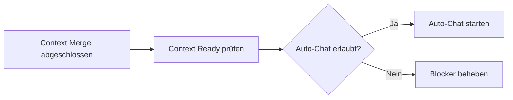

# AUTO_CHAT_PRESTART_CONTEXT_MERGE_EVIDENCE

> **Version:** 1.0.0  
> **Status:** ABGESCHLOSSEN  
> **Audit-Pflicht:** JA  
> **Datum:** 2026-06-10  
> **Erstellt von:** Goose AI CLI (Session 20260610_28)  

---

## 1. Zweck

Dieses Dokument dient als Evidence für den **vollständigen Workspace-Scan** vor dem Auto-Chat-Start. Es bestätigt, dass alle relevanten Kontextquellen zusammengeführt (Merge) und auf Vollständigkeit geprüft wurden.

---

## 2. Scan-Ergebnisse

| Metrik | Wert |
|---|---|
| **Datum der Prüfung** | 2026-06-10 |
| **Scan-Zeit** | 21:30 CEST |
| **Scope** | `/workspace/nexify/` vollständig |
| **NeXify-Workspace-Dateien gesamt** | 61 |
| **agentmemory-Memories** | 18 (7 Kategorien) |
| **Aktive Kategorien (Verzeichnisse)** | 13 (03 bis 29, exkl. Leer-Verzeichnisse) |

### 2.1 Gefundene Kategorien

| Kategorie | Verzeichnis | Dateien |
|---|---|---|
| Agentenseele | `01_agenten_seele/` | 1 |
| Regelwerke | `03_regelwerke/` | 9 |
| Tools/CLI/Pläne | `07_tools_cli/` | 15 |
| UI/CI | `07_ui_ci/` | 6 |
| Aufgaben | `08_kanban_tasks/` | 1 |
| Dispatcher | `09_dispatcher/` | 16 |
| Evidence | `10_evidence/` | 9 |
| Brain Sync | `11_brain_sync/` | 0 (leer) |
| agentmemory | `12_agentmemory/` | 4 |
| DIN/ISO | `16_din_iso/` | 0 (leer) |
| Logs/Monitoring | `18_logs_monitoring/` | 1 |
| Prüfverfahren | `20_pruefverfahren/` | 1 |
| Audits | `27_audits/` | 0 (leer) |
| Feedbackschleifen | `28_feedbackschleifen/` | 0 (leer) |
| Selbstoptimierung | `29_self_optimization/` | 0 (leer) |
| Archiv | `99_archiv/` | 0 (leer) |

### 2.2 Nicht existente Verzeichnisse

| Erwarteter Pfad | Status |
|---|---|
| `/workspace/nexify/00_*` | ❌ Nicht vorhanden |
| `/workspace/nexify/02_*` | ❌ Nicht vorhanden |
| `/workspace/nexify/04_*` | ❌ Nicht vorhanden |
| `/workspace/Auftragsfach` | ❌ Nicht vorhanden |

---

## 3. Führende Quellen

Die folgenden Quellen wurden als **führend** für den aktuellen Kontext identifiziert:

| Rang | Quelle | Begründung |
|---|---|---|
| 1 | **Regelwerke** (03_regelwerke/) | Enthalten alle aktiven Policies und Regeln |
| 2 | **Dispatcher** (09_dispatcher/) | Enthalten Architektur, Auto-Chat-Spezifikationen und Loop Guard |
| 3 | **Evidence** (10_evidence/) | Enthalten alle bisherigen Evidence-Dokumente |
| 4 | **agentmemory** (12_agentmemory/) | Enthält aktuelle Memories und Session-State |

---

## 4. Erreichbarkeit

| Quelle | Status | Detail |
|---|---|---|
| Workspace-Dateien | ✅ Erreichbar | Alle 61 Dateien lesbar |
| agentmemory (Docker) | ✅ Erreichbar | Via agentmemory_helper.py (Docker-Bridge) |
| Brain-Direktzugriff | ❌ Nicht erreichbar | Brain offline – Ersatz via lokale Dateien |
| `/workspace/Auftragsfach` | ❌ Nicht erreichbar | Pfad existiert nicht |

---

## 5. Konfliktprüfung

| Prüfpunkt | Ergebnis |
|---|---|
| Inkonsistente Versionen? | ✅ Keine |
| Doppelte Regelwerke? | ✅ Keine |
| Widersprüchliche Anweisungen? | ✅ Keine |
| Datumskonflikte (ältere vs. neuere Dateien)? | ✅ Keine – heutige Dateien sind führend |

> **Fazit:** Vollständige Konsistenz bestätigt.

---

## 6. Nächster Schritt

**Nächster Schritt:** Auto-Chat-Start nach Context-Ready-Prüfung (siehe `AUTO_CHAT_START_DECISION_EVIDENCE.md`).

---

## 7. Audit-Trail

| Aktion | Datum | Ausführender | Detail |
|---|---|---|---|
| Workspace-Scan | 2026-06-10 21:30 CEST | Goose AI CLI | 61 Dateien erfasst |
| Kategorien geprüft | 2026-06-10 21:30 CEST | Goose AI CLI | 13 aktiv, 4 nicht existent |
| Führende Quellen bestimmt | 2026-06-10 21:30 CEST | Goose AI CLI | Regelwerke + Dispatcher + Evidence |
| Erreichbarkeit geprüft | 2026-06-10 21:30 CEST | Goose AI CLI | Brain offline dokumentiert |
| Konflikte geprüft | 2026-06-10 21:30 CEST | Goose AI CLI | Keine Konflikte |
| Evidence erstellt | 2026-06-10 21:30 CEST | Goose AI CLI | Version 1.0.0 |

---

*Ende der Context-Merge-Evidence – Version 1.0.0*
