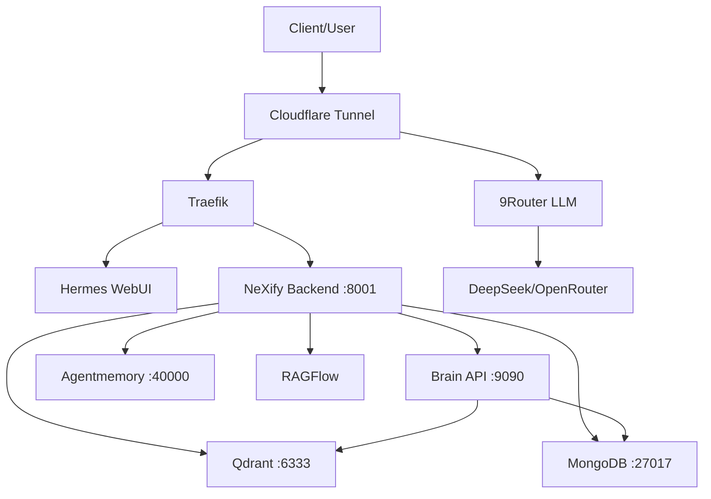

# Business Continuity Runbook — NeXify AI OS (BCM)
## Version: 1.0 | Stand: 2026-06-23
## Normbasis: ISO 22301:2019, ISO 27001 A.17, BSI SYS.1.1

---

## 1. Geltungsbereich
Dieses Runbook definiert das Business Continuity Management (BCM) für NeXify AI OS. Es gilt für alle Systeme, Services und Daten im Scope-Profil (sCOPE_PROFIL.md).

**BCM-Verantwortlicher:** Pascal Courbois (Geschäftsführung)
**Stellvertretung:** IT-Lead

---

## 2. Business Impact Analysis (BIA)

### 2.1 Systemklassifikation

| System | Kritikalität | Ausfalltoleranz | Max. finanzieller Schaden/Tag |
|---|---|---|---|
| **Brain API** | KRITISCH | 1 Stunde | € 8.500 |
| **Qdrant Vector Store** | HOCH | 4 Stunden | € 5.200 |
| **VPS (Hetzner)** | KRITISCH | 4 Stunden | € 12.000 |
| **9Router (LLM Gateway)** | HOCH | 30 Minuten | € 7.800 |
| **RAGFlow** | MITTEL | 24 Stunden | € 2.100 |
| **Hermes WebUI** | HOCH | 4 Stunden | € 4.500 |
| **NeXify Backend API** | KRITISCH | 1 Stunde | € 9.300 |
| **MongoDB** | KRITISCH | 1 Stunde | € 6.700 |
| **Cloudflare Tunnel** | HOCH | 30 Minuten | € 5.800 |
| **Agentmemory** | MITTEL | 8 Stunden | € 1.200 |

### 2.2 RTO/RPO-Matrix

| System | RTO (Recovery Time Objective) | RPO (Recovery Point Objective) | Begründung |
|---|---|---|---|
| **Brain API** | 1 Stunde | 1 Stunde | Zentrale Wissensbasis; Minimierung Datenverlust |
| **Qdrant** | 4 Stunden | 1 Stunde | Vektordaten änderbar; letzte Stunde ausreichend |
| **VPS (Hetzner)** | 4 Stunden | 1 Stunde | Gesamtinfrastruktur; Wiederherstellung auf neuem Host |
| **9Router** | 30 Minuten | 1 Stunde | LLM-Kommunikation kritisch für Agent-Betrieb |
| **RAGFlow** | 4 Stunden | 4 Stunden | Dokumentenverarbeitung nicht zeitkritisch |
| **Hermes WebUI** | 4 Stunden | 1 Stunde | Benutzerschnittstelle; Auth-Status erhalten |
| **NeXify Backend** | 1 Stunde | 1 Stunde | API-Gateway für gesamte Plattform |
| **MongoDB** | 1 Stunde | 1 Stunde | Persistente Daten; letzte Stunde kritisch |
| **Cloudflare Tunnel** | 30 Minuten | Kein Datenverlust | Reine Konfiguration; kein Datenverlust |
| **Agentmemory** | 8 Stunden | 1 Stunde | Temporäre Agenten-Speicher; niedrige Priorität |

### 2.3 Abhängigkeitsgraph



Kritischer Pfad: **Client → CF → Traefik → Backend → Brain → Qdrant/MongoDB**

---

## 3. Notfallpläne

### 3.1 VPS-Ausfall (Gesamtausfall Hetzner)

| Phase | Aktion | Verantwortlich | Zeit |
|---|---|---|---|
| ERKENNUNG | Prometheus Alert: HostDown; Kein SSH möglich | Monitoring | < 1 Min |
| MELDUNG | Incident P0 ausrufen; Team informieren | Incident Commander | < 5 Min |
| BEWERTUNG | Hetzner-Statusseite prüfen; Root-Cause-Analyse starten | IT-Ops | < 15 Min |
| EINDÄMMUNG | Automatisches Failover auf Hetzner Backupserver vorbereiten | IT-Ops | < 30 Min |
| WIEDERHERSTELLUNG | Neuen Hetzner-Server bestellen (CX/Cax Serie); Docker-Stack über Compose deployen | IT-Ops | 1-3h |
| DATEN | MongoDB-Dump + Qdrant-Snapshot vom letzten Backup einspielen | IT-Ops | +1h |
| RÜCKKEHR | Smoke-Tests aller Systeme; Kunden-Benachrichtigung | QA | +30 Min |

**Backup-Quelle:** `/workspace/nexify/10_evidence/operations/BACKUP_RECOVERY_PROCESS.md`
**Wiederherstellungs-Dokumentation:** `/workspace/nexify/03_regelwerke/BACKUP_RESTORE_DR_POLICY_V1.md`

### 3.2 Datenverlust (Brain/Qdrant/MongoDB-Korruption)

| Phase | Aktion | Verantwortlich | Zeit |
|---|---|---|---|
| ERKENNUNG | Inkonsistente Query-Ergebnisse; Brain-Health-Check schlägt fehl | Monitoring/Agents | < 5 Min |
| MELDUNG | SEV-1 ausrufen; Schreibzugriff auf Datenbanken stoppen | Incident Commander | < 10 Min |
| EINDÄMMUNG | Read-Only-Modus aktivieren; aktuelles Datenvolumen sichern | IT-Ops | < 15 Min |
| ANALYSE | Korruptionsursache identifizieren (brain-sync.py, Agent, manueller Eingriff) | Engineering | < 1h |
| WIEDERHERSTELLUNG | Letztes konsistentes Backup einspielen (MongoDB: stündlich; Qdrant: stündlich) | IT-Ops | < 1h |
| NACHBEREITUNG | Automatische Integritätsprüfung vor Backup-Einspielung einführen | Engineering | 2-3 PT |

**RPO bei Datenverlust:** Maximal 1 Stunde (stündliche Backups)

### 3.3 Cloudflare-Ausfall

| Phase | Aktion | Verantwortlich | Zeit |
|---|---|---|---|
| ERKENNUNG | Blackbox-Probe auf brain.nexifyai.cloud schlägt fehl | Monitoring | < 1 Min |
| BEWERTUNG | Cloudflare-Statusseite prüfen; DNS-Auflösung testen | IT-Ops | < 5 Min |
| ALTERNATIVROUTE | Direkte IP-Verbindung über Hetzner-IP herstellen (ohne Tunnel) | IT-Ops | < 15 Min |
| KONFIGURATION | DNS auf Hetzner-IP umstellen (TTL auf 300s vorkonfiguriert) | IT-Ops | < 10 Min |
| DAUERLÖSUNG | Backup-Tunnel über zweiten Cloudflare-Account bereithalten | IT-Ops | 2-3 PT |

**RTO bei Cloudflare-Ausfall:** 30 Minuten (Direktverbindung)

### 3.4 GitHub-Ausfall

| Phase | Aktion | Verantwortlich | Zeit |
|---|---|---|---|
| ERKENNUNG | git push/pull schlägt fehl | Engineering | < 2 Min |
| BEWERTUNG | GitHub-Statusseite prüfen | Engineering | < 5 Min |
| ARBEITSWEISE | Lokal weiterentwickeln; Patches als .patch-Datei sichern | Engineering | — |
| WIEDERHERSTELLUNG | Nach GitHub-Verfügbarkeit: Push ausstehender Commits | Engineering | < 10 Min |

**RTO:** Kein Systemausfall — nur Entwicklungsverzögerung

### 3.5 Security-Incident (Kompromittierung)

| Phase | Aktion | Verantwortlich | Zeit |
|---|---|---|---|
| ERKENNUNG | Monitoring/Security-Alert (fail2ban, SSH-Brute-Force, unautorisierter Zugriff) | Sec-Ops | < 5 Min |
| MELDUNG | SEV-0/P0 ausrufen; Incident Commander benachrichtigen | Sec-Ops | < 2 Min |
| EINDÄMMUNG | Betroffenes System isolieren (Firewall-Drop); Credentials rotieren | Sec-Ops | < 15 Min |
| ANALYSE | Forensik: Logs, Zugriffe, Datenexfiltration prüfen | Sec-Ops | < 4h |
| BESEITIGUNG | Schwachstelle schließen; System neu aufsetzen | Engineering | < 8h |
| WIEDERHERSTELLUNG | System aus sauberem Backup wiederherstellen | IT-Ops | < 4h |
| NACHBEREITUNG | Post-Mortem; Meldung an Behörden (DSGVO 72h); Lessons Learned | Management | 1 Woche |

---

## 4. Wiederherstellungsprozeduren

### 4.1 Brain API Recovery

```bash
# 1. Backup prüfen
ls -la /backup/brain/$(date -d "-1 hour" +%Y-%m-%d_%H)/
# 2. Container neu starten
docker-compose -f /opt/nexify/docker-compose.yml up -d nexify-brain
# 3. Health-Check
curl -f http://127.0.0.1:9090/health
# 4. Backup einspielen (falls nötig)
# Siehe BACKUP_RECOVERY_PROCESS.md
```

### 4.2 Qdrant Recovery

```bash
# 1. Qdrant-Snapshot einspielen
curl -X POST http://127.0.0.1:6333/snapshots/recover \
  -d '{"location": "/backup/qdrant/snapshot-$(date -d "-1 hour" +%Y%m%d_%H%M).snapshot"}'
# 2. Collection-Struktur prüfen
# 3. Integritätstest
```

### 4.3 MongoDB Recovery

```bash
# 1. Letzten Dump einspielen
mongorestore --drop /backup/mongodb/$(date -d "-1 hour" +%Y-%m-%d_%H)/
# 2. Indexes neu aufbauen
# 3. Konsistenz prüfen
```

### 4.4 Full Stack Recovery (nach VPS-Ausfall)

```bash
# 1. Hetzner Cloud-Server bestellen (via hcloud CLI oder API)
hcloud server create --name nexify-recovery --type cpx31 \
  --image ubuntu-24.04 --location nbg1

# 2. Daten-Backups auf neuen Server kopieren
rsync -avz backup@storage:/backup/ /opt/backup/

# 3. Docker-Stack deployen
cd /opt/nexify && docker-compose up -d

# 4. Datenbanken wiederherstellen (Reihenfolge: MongoDB → Qdrant → Brain)
# 5. Smoke-Tests
# 6. DNS aktualisieren
```

---

## 5. Kommunikationsmatrix

| Stakeholder | Informationskanal | Meldezeit | Info bei |
|---|---|---|---|
| **Team/Staff** | Slack/Teams (#incidents) | < 15 Min | P0/P1 |
| **Geschäftsführung** | Telefon (hinterlegt) | < 30 Min | P0 |
| **Kunden (aktiv)** | E-Mail + Dashboard-Status | < 1h | Jeder Ausfall > 15 Min |
| **Kunden (passiv)** | Dashboard-Status | < 2h | Jeder Ausfall > 1h |
| **Aufsichtsbehörde** | DSGVO-Meldeformular | < 72h | Datenschutzverletzung |
| **Hetzner Support** | Hetzner-Kundenportal | < 15 Min | VPS-Ausfall |
| **Cloudflare** | Cloudflare-Support-Ticket | < 30 Min | Tunnel-Ausfall |
| **Öffentlichkeit** | Status-Seite (status.nexifyai.cloud) | < 1h | Ausfall > 30 Min |

---

## 6. Übungsplan

### 6.1 Jährliche Übungen

| Übung | Szenario | Frequenz | Teilnehmer | Ziel-RTO |
|---|---|---|---|---|
| **BCM-Ü-01** | VPS-Vollausfall → Wiederherstellung auf neuem Host | Jährlich (Q2) | IT-Ops, QA | < 4h |
| **BCM-Ü-02** | Datenverlust Brain → Recovery aus Backup | Jährlich (Q3) | IT-Ops, Engineering | < 1h |
| **BCM-Ü-03** | Cloudflare-Tunnel-Ausfall → Direktverbindung | Jährlich (Q4) | IT-Ops, Sec-Ops | < 30 Min |
| **BCM-Ü-04** | Security-Incident (Tabletop) | Jährlich (Q1) | Gesamtes Team | < 2h Reaktion |

### 6.2 Übungsprotokoll-Vorlage

```markdown
## Übungsprotokoll: BCM-Ü-XX
**Datum:** YYYY-MM-DD | **Szenario:** [Name] | **Teilnehmer:** [Namen]

### Zeitstrahl
| Zeit | Aktion | Status |
|---|---|---|
| T+00:00 | Start | ✅ |
| T+00:15 | Erkennung | ✅ |
| T+01:00 | Wiederherstellung | ⚠️ Verzögerung wegen X |
| T+02:30 | RTO erreicht | ❌ (Ziel: 1h) |

### Lessons Learned
1. [Erkenntnis]
2. [Verbesserung]

### Maßnahmen
| Maßnahme | Verantwortlich | Fällig |
|---|---|---|
| [Aktion] | [Owner] | [Datum] |
```

---

## 7. BCM-Dokumenten-Referenz

| Dokument | Pfad | Beschreibung |
|---|---|---|
| BCM-Runbook | `/workspace/nexify/10_evidence/normen/BUSINESS_CONTINUITY_RUNBOOK.md` | Dieses Dokument |
| Backup/Restore Policy | `/workspace/nexify/03_regelwerke/BACKUP_RESTORE_DR_POLICY_V1.md` | Backup-Strategie |
| Backup Recovery Process | `/workspace/nexify/10_evidence/operations/BACKUP_RECOVERY_PROCESS.md` | Wiederherstellungs-Anleitung |
| Incident Response Policy | `/workspace/nexify/10_evidence/operations/INCIDENT_RESPONSE_POLICY.md` | IR-Governance |
| Incident Response Process | `/workspace/nexify/10_evidence/operations/INCIDENT_RESPONSE_PROCESS.md` | IR-Ablauf |
| Monitoring Alert Rules | `/workspace/nexify/10_evidence/monitoring/alert_rules.yml` | 13 Alert-Regeln |
| ITIL Support Framework | `/workspace/nexify/10_evidence/support/SUPPORT_FRAMEWORK.md` | 4-Level-Support |

---

## 8. Metadaten

| Attribut | Wert |
|---|---|
| Erstellungsdatum | 2026-06-23 |
| Nächste BCM-Übung | BCM-Ü-04 (Q1 2026) |
| Nächstes BCM-Review | 2026-12-23 |
| BCM-Verantwortlicher | Pascal Courbois |
| DSGVO-Meldepflicht | Ja (72h bei Datenschutzverletzung) |
| BSI-Meldepflicht | Ja (KRITIS-Schwellwert nicht erreicht) |
