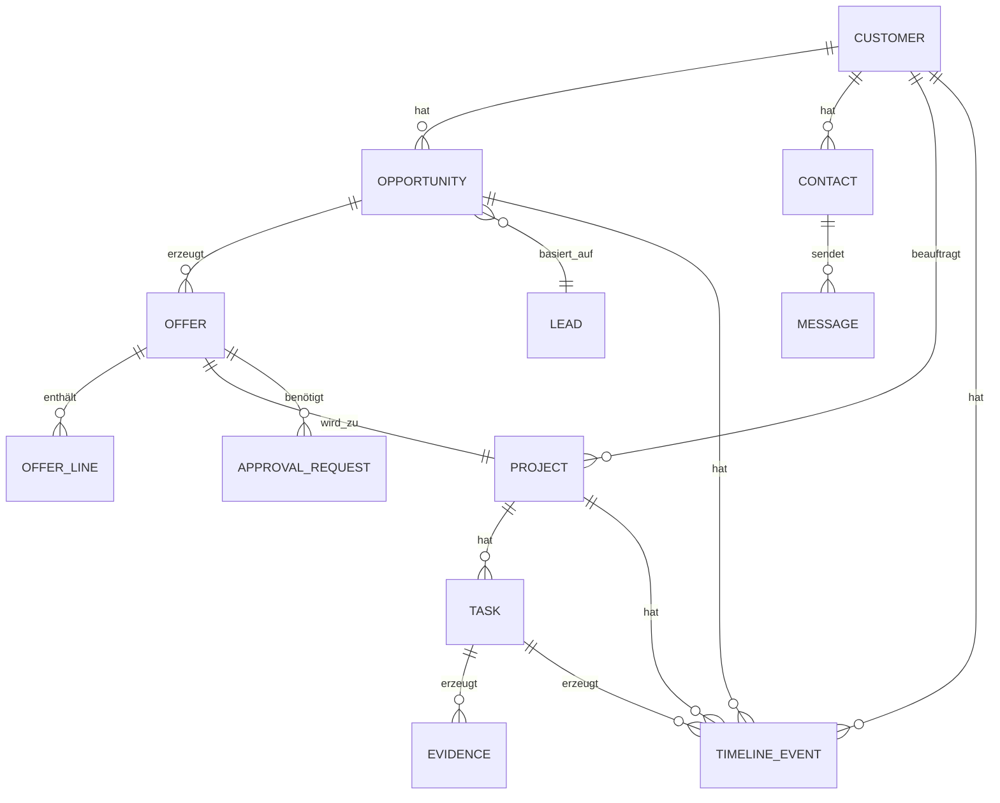

# NeXify AI — CRM-Datenmodell V1 (Blueprint)

**Stand:** 2026-06-12 | **Status:** VERBINDLICH | **Version:** 1.0.0
**Owner:** Sales / NeXify AI
**Klassifikation:** nexify_internal

---

## 1. Entity-Übersicht



## 2. Entitäten

### Customer
```
id: UUID
name: String
type: "lead" | "customer" | "partner"
status: "active" | "inactive" | "lost"
industry: String
website: String
phone: String
address: String
notes: Text
created_at: Timestamp
updated_at: Timestamp
```

### Contact
```
id: UUID
customer_id: UUID (FK)
first_name: String
last_name: String
email: String
phone: String
role: String
is_primary: Boolean
created_at: Timestamp
```

### Lead
```
id: UUID
source: "website" | "chat" | "search" | "referral" | "manual"
status: "new" | "qualified" | "pending" | "converted" | "lost"
product_interest: String
budget_range: String
timeline: String
notes: Text
created_at: Timestamp
```

### Opportunity
```
id: UUID
customer_id: UUID (FK)
lead_id: UUID (FK, nullable)
name: String
stage: "discovery" | "scoping" | "proposal" | "negotiation" | "closed_won" | "closed_lost"
value: Decimal
probability: Integer
expected_close_date: Date
created_at: Timestamp
```

### Offer
```
id: UUID
opportunity_id: UUID (FK)
version: Integer
status: "draft" | "review" | "approved" | "sent" | "accepted" | "rejected"
total_amount: Decimal
discount: Decimal
margin: Decimal
valid_until: Date
pdf_path: String
created_at: Timestamp
```

### OfferLine
```
id: UUID
offer_id: UUID (FK)
product_name: String
description: Text
quantity: Integer
unit_price: Decimal
total: Decimal
```

### Project
```
id: UUID
customer_id: UUID (FK)
offer_id: UUID (FK, nullable)
name: String
status: "pending" | "active" | "review" | "completed" | "cancelled"
start_date: Date
end_date: Date
budget: Decimal
created_at: Timestamp
```

### Task
```
id: UUID
project_id: UUID (FK)
title: String
description: Text
status: "open" | "in_progress" | "review" | "done"
assignee: String
priority: "P0" | "P1" | "P2" | "P3"
created_at: Timestamp
```

### TimelineEvent
```
id: UUID
entity_type: "customer" | "opportunity" | "project" | "offer"
entity_id: UUID
event_type: String
description: Text
created_by: String
created_at: Timestamp
```

### ApprovalRequest
```
id: UUID
entity_type: "offer" | "project" | "lead"
entity_id: UUID
requested_by: String
status: "pending" | "approved" | "rejected"
note: Text
created_at: Timestamp
```

## 3. Datenhaltung

- Primär: Supabase PostgreSQL
- Auth: Supabase Auth (RLS)
- Realtime: Supabase Realtime (Timeline-Events)
- Storage: Supabase Storage (PDFs, Angebote)
