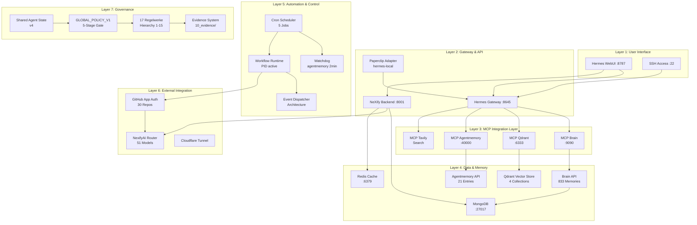
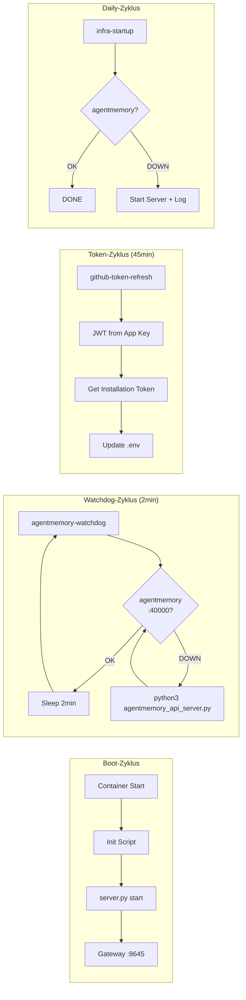

# NeXify System — Master Integration Plan V1
**Stand:** 2026-06-20 | **Status:** VERBINDLICH | **Version:** 1.0.0
**Autor:** network-engineer (Ralph Loop Consolidation)

---

## 1. System-Architektur-Übersicht



## 2. Integrationen im Detail

### 2.1 MCP Server (Layer 3)
| Server | Port | PID | Status | Tools |
|--------|------|-----|--------|-------|
| brain | MCP stdio | 300 | ✅ active | brain_query |
| qdrant | 6333 | 301 | ✅ active | qdrant_search, qdrant_store, qdrant_delete |
| agentmemory | 40000 | 302 | ✅ active | agentmemory_health, agentmemory_save, agentmemory_search, agentmemory_stats |
| tavily-search | MCP stdio | 304 | ✅ active | web_search |

### 2.2 Cron Jobs (Layer 5)
| Job | Schedule | Script | Purpose |
|-----|----------|--------|---------|
| github-token-refresh | */45 * * * * | refresh_github_token.py | GitHub App Installationstoken erneuern |
| agentmemory-watchdog | */2 * * * * | agentmemory-watchdog.py | Agentmemory am Leben halten |
| kanban-auto-dispatch | every 1m | auto-dispatch.sh | Task-Verteilung |
| qa-sweep-auto | every 60m | — | Qualitätssicherung |
| infra-startup-agentmemory | 0 0 * * * | startup.sh | Boot-Start Agentmemory |

### 2.3 Paperclip Integration
- **Adapter:** Hermes Paperclip Adapter (TypeScript)
- **Status:** ✅ Built (dist/ vorhanden)
- **Config:** `/workspace/hermes-paperclip-adapter/paperclip.json`
- **Profile:** 10 Hermes-Profile registriert (ceo, cto, cso, network-engineer, agentur-admin, mcp-agent, monitoring-agent, workflow-agent, automation-agent, vps-admin)
- **Heartbeat:** Alle 60 Minuten via :8645/health
- **Model:** nexifyai-combo-llm via ai-router.nexifyai.cloud

### 2.4 Shared Agent State
- **Pfad:** `~/.hermes/agent-system/state/shared-agent-state.json`
- **Version:** v4 (aktualisiert)
- **Status:** 3 aktive Agents, system_health operational
- **Tracking:** Ralph Loop Iteration 4

## 3. Autonomer Betrieb — Architektur



## 4. Offene Integrationen (P0)

| Integration | Status | Blockade | Lösung |
|-------------|--------|----------|--------|
| Supabase KEY | 🔴 BLOCKED | Kein /root/.nexify/secrets/ Zugriff | Root auf Host nötig |
| Brain Write-Key | 🔴 BLOCKED | Fehlt in Config | Secret aus /root/ oder Brain-API-Config |
| Gateway systemd | 🟡 WARN | Kein sudo im Container | Gateway läuft als WebUI-integriert |
| Paperclip Live | 🟡 WARN | Kein Paperclip-Server im Container | Lokaler Modus reicht für autonomen Betrieb |

## 5. Consolidation Map: Was-wird-womit-verbunden

```
Hermes WebUI (:8787)
  ├── Hermes Gateway (:8645) → MCP Brain → Brain API (:9090)
  │                             MCP Qdrant → Qdrant (:6333)
  │                             MCP Agentmemory → Agentmemory (:40000)
  │                             MCP Tavily → Web Search
  ├── Backend API (:8001) → MongoDB (:27017)
  │                         Redis (:6379)
  │                         NexifyAI Router (Cloud)
  ├── Cron Scheduler → 5 Jobs (Watchdog, Refresh, Dispatch, QA, Startup)
  ├── Shared Agent State → Governance (Policy, Rules, Evidence)
  └── Paperclip Adapter → External Integration (10 Profiles)

GitHub App Auth (ID 3865469)
  ├── Org Installation → 6 Repos (nexifyai-platform etc.)
  └── User Installation → 24 Repos (nexifyai-dev/*)

NexifyAI Router (ai-router.nexifyai.cloud)
  ├── 51 Models (combo-llm, deepseek-v4*, gpt-5*, claude-*, gemini-*)
  └── API Key (35 Zeichen, auto-refresh via GitHub App)

Agentmemory (:40000)
  ├── ChromaDB Backend (sqlite-fts5)
  ├── Watchdog (alle 2min)
  ├── Boot-Cron (täglich)
  └── 21 Memories (e2e, default, brain, memories, notes, general)
```

## 6. Nächste Schritte (autonome Ausführung)

1. ✅ Shared Agent State v4 geschrieben
2. ⬜ Integration Plan-finalisieren + in Brain speichern
3. ⬜ Paperclip-Adapter: Health-Check-Endpoint testen
4. ⬜ Workflow Runtime: Health prüfen + Auto-Restart einrichten
5. ⬜ Autonomen Betrieb durch Cron + Watchdog bestätigen
6. ⬜ Evidence dieser Integration in /workspace/nexify/10_evidence/ schreiben
